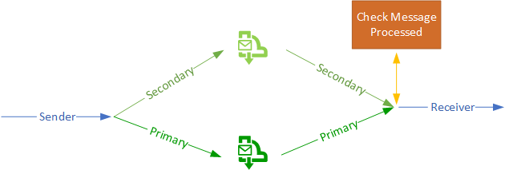
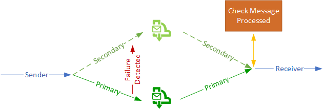

# Azure Service Bus - High Availability Patterns

Azure Service High Availability Pattern

## Service Bus - Geo-Disaster Recovery

Currently Azure Service Bus in geo-disaster recovery copies the metadata only, but not the data. The secondary region is readonly and becomes writable once a failover is initiated. Messages could be stranded in the primary region once it comes back up, and there's a need to recreate the pairings from the secondary to the primary after to protect against future region outages.

- https://docs.microsoft.com/en-us/azure/service-bus-messaging/service-bus-geo-dr

## Other Approaches to protect the data

This document discusses other approaches to making the messages more resilient and highly availably using an active-active and active-passive approach which is discussed in detailed in this video:

- https://channel9.msdn.com/Blogs/Subscribe/Service-Bus-Messaging-High-Availability-Options?term=service%20bus%20high%20availability&lang-en=true

## Active-Active Approach

- Create two namespaces in different regions
- Create a queue with the same name in the different regions
- Send a message to both regions
- Receive messages from both regions
  - Have logic to determine if message has already been processed

### Diagram

<p align="center">
  
</p>

## Active-Passive Approach

- Create two namespaces in different regions
- Create a queue with the same name in the different regions
- Send a message to primary region
- On failure, send messages to secondary region
- Receive from both regions
  - Have logic to determine if message has already been processed 

### Diagram

<p align="center">
  
</p>

## Emmitter Logic

- Active-Active: Try to write message to both regions.
- Active-Passive: Detect failure in primary, and then switch to secondary on failure.

```c#
private static async Task SendMessageHAAsync(Message message)
{
    if (!primaryAvailable && !secondaryAvailable)
    {
        Console.WriteLine("No region is available to write messages.");
        await CloseAsync();
        Environment.Exit(-1);
    }

    try
    {
        await primaryQueueClient.SendAsync(message);
    }
    catch (Exception)
    {
        primaryAvailable = false;
    }
    if (Mode == ProcessingMode.ActiveActive || (Mode == ProcessingMode.ActivePassive && !primaryAvailable))
        try
        {
            await secondaryQueueClient.SendAsync(message);
        }
        catch (Exception)
        {
            //throw;
            secondaryAvailable = false;
        }
}
```

## Receiver Logic

Process from one region, and discard from second region if message has already been processed.

```c#
static void RegisterOnMessageHandlerAndReceiveMessages()
{
    // Configure the MessageHandler Options in terms of exception handling, number of concurrent messages to deliver etc.
    var messageHandlerOptions = new MessageHandlerOptions(ExceptionReceivedHandler)
    {
        // Maximum number of Concurrent calls to the callback `ProcessMessagesAsync`, set to 1 for simplicity.
        // Set it according to how many messages the application wants to process in parallel.
        MaxConcurrentCalls = 2,

        // Indicates whether MessagePump should automatically complete the messages after returning from User Callback.
        // False below indicates the Complete will be handled by the User Callback as in `ProcessMessagesAsync` below.
        AutoComplete = false
    };
    // Register the function that will process messages
    primaryQueueClient?.RegisterMessageHandler(PrimaryProcessMessagesAsync, messageHandlerOptions);
    secondaryQueueClient?.RegisterMessageHandler(SecondaryProcessMessagesAsync, messageHandlerOptions);
}

static async Task PrimaryProcessMessagesAsync(Message message, CancellationToken token)
{
    // Process the message
    Console.WriteLine($"Received message: SequenceNumber:{message.SystemProperties.SequenceNumber} Body:{Encoding.UTF8.GetString(message.Body)}");
    var jobid = (Guid)message.UserProperties[Common.Contants.IdProperty];
    if (!IsProcessed(jobid))
    {
        Console.WriteLine($"{jobid}: Processing from Primary");
    }
    // Complete the message so that it is not received again.
    // This can be done only if the queueClient is created in ReceiveMode.PeekLock mode (which is default).
    await primaryQueueClient.CompleteAsync(message.SystemProperties.LockToken);
    // Note: Use the cancellationToken passed as necessary to determine if the queueClient has already been closed.
    // If queueClient has already been Closed, you may chose to not call CompleteAsync() or AbandonAsync() etc. calls 
    // to avoid unnecessary exceptions.
}
```

## Messages Already Processed Logic

This sample app uses a very simple approach to keep state in memory, but in production this should be replaced with a more resilient and scalable solution.

```c#
static object obj = new object();
static List<Guid> State = new List<Guid>();

static bool IsProcessed(Guid guid)
{
    lock (obj)
    {
        if (State.Contains(guid))
            return true;
        State.Add(guid);
        return false;
    }
}
```


